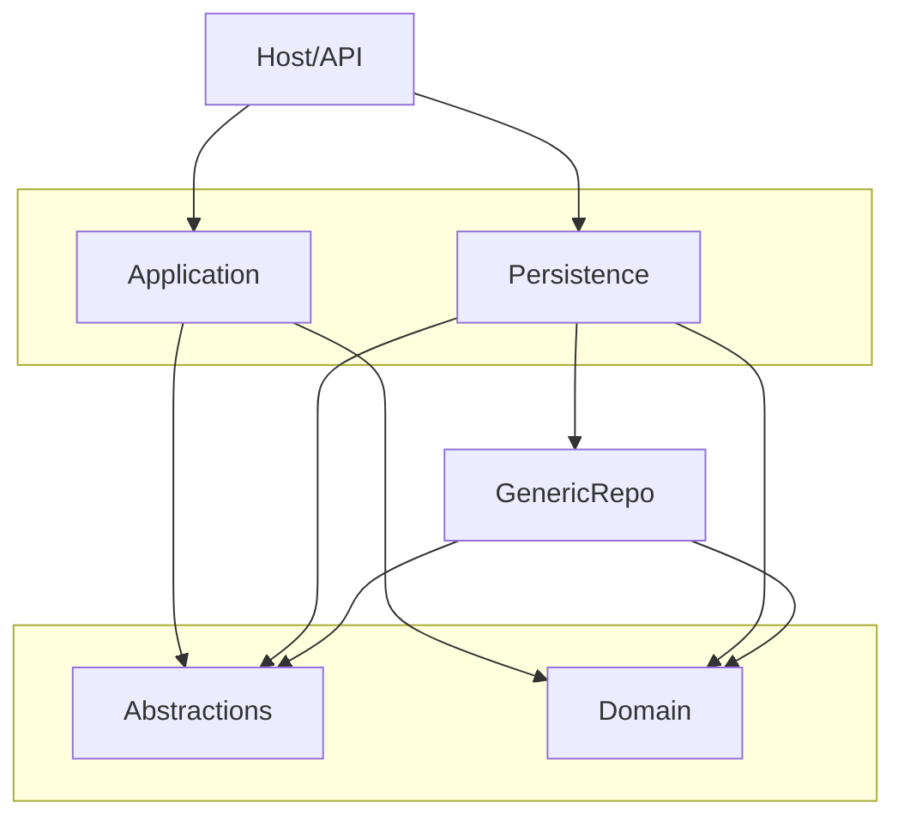
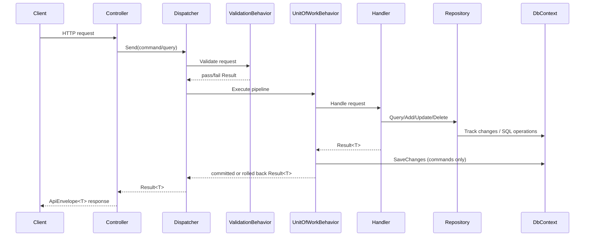

# Backend Foundation Template - Architecture Guide

## 1) Purpose
This template is a Clean Architecture backend foundation designed for reuse across projects.

Main goals:
- strict layer boundaries
- reusable repository/unit-of-work contracts
- provider-agnostic application logic
- consistent API envelope and error handling

The template is intentionally minimal and does not include business-specific sample modules.

## 2) Solution Structure

```text
Backend.Foundation.Template.sln
|- Backend.Foundation.Template                 (Host/API)
|- Backend.Foundation.Template.Application     (Use-cases, handlers, behaviors)
|- Backend.Foundation.Template.Domain          (Entities, value objects, domain base types)
|- Backend.Foundation.Template.Abstractions    (Contracts: repository, UoW, results, paging)
|- Backend.Foundation.Template.GenericRepo     (EF + Mongo generic repository implementations)
|- Backend.Foundation.Template.Persistence     (DbContext, provider wiring, EF configs/migrations)
|- docs/ARCHITECTURE_GUIDE.md
```

## 3) Dependency Direction (Clean Architecture)



Rules:
- `Domain` never depends on infrastructure.
- `Application` depends on `Domain` + `Abstractions` only.
- `Persistence` and `GenericRepo` provide concrete infrastructure.
- `Host` composes all dependencies.

## 4) Layer Responsibilities

### Domain
Contains:
- base entity hierarchy (`Entity`, `AuditableEntity`, `SoftDeletableEntity`, `AggregateRoot`)
- domain entities/value objects/events
- invariants and domain behavior

Must not contain:
- EF/Mongo infrastructure code
- HTTP/DTO/controller code

### Abstractions
Contains:
- `IRepository<,>`, `IUnitOfWork`
- result model (`Result`, `Error`)
- paging contracts
- clock abstraction

Purpose:
- shared contracts consumed by `Application`

### Application
Contains:
- commands/queries and handlers
- validators
- pipeline behaviors (validation + unit-of-work)
- dispatcher

Purpose:
- orchestrate use-cases with infrastructure-agnostic logic

### GenericRepo
Contains:
- `EfRepository<TEntity, TKey>` and `EfUnitOfWork`
- `MongoRepository<TEntity, TKey>` and `MongoUnitOfWork`
- shared helpers (ordering, cursor, metadata, audit stamping)

Purpose:
- reusable generic data-access engine

### Persistence
Contains:
- `AppDbContext`
- EF configurations
- EF migrations
- provider registration for SQL Server/Postgres/Mongo

Purpose:
- infrastructure composition and model mapping

### Host/API
Contains:
- controllers
- API envelope mapping
- global exception middleware
- app startup/DI registration

Purpose:
- HTTP transport and runtime hosting

## 5) Request Processing Workflow



## 6) Transactions and Rollback

For commands:
- `UnitOfWorkBehavior` executes inside `IUnitOfWork.ExecuteInTransactionAsync`.
- Success result => `SaveChangesAsync` + commit.
- Failure result => rollback.
- Exception => rollback/no commit.

For queries:
- no save/no transaction commit path.

Provider caveat:
- EF provider executes real DB transactions for command pipeline writes.
- Mongo provider currently uses immediate writes and does not provide EF-equivalent cross-operation atomic transactions by default.
- If a use-case requires strict multi-write atomicity on Mongo, implement session-based transactions explicitly for that flow.

## 7) Audit and Soft Delete

`AppDbContext` applies conventions:
- Added => sets `CreatedAtUtc`.
- Modified => sets `UpdatedAtUtc`.
- Deleted soft-deletable => converts to update:
  - `IsDeleted = true`
  - `DeletedAtUtc = utcNow`
  - `UpdatedAtUtc = utcNow`

Timezone note:
- PostgreSQL `timestamp with time zone` stores an instant.
- DB tools may display values in session/local timezone.

## 8) Generic Repository Capabilities

Read/query:
- `Query(...)`
- `GetByIdAsync(...)`
- `GetManyByIdsAsync(...)`
- `FirstOrDefaultAsync(...)`
- `ListAsync(...)`
- `AnyAsync(...)`
- `CountAsync(...)`
- `LongCountAsync(...)`

Write/update:
- `AddAsync(...)`
- `AddRangeAsync(...)`
- `Update(...)` (tracked-safe)
- `PatchAsync(...)`

Delete:
- `SoftDeleteByIdAsync(...)`
- `SoftDeleteWhereAsync(...)`
- `HardDeleteWhereAsync(...)`

Paging:
- `PaginatedAsync(...)` (offset)
- `CursorPaginatedAsync(...)` (cursor)

Transactions:
- repository-level `ExecuteInTransactionAsync(...)`
- command pipeline transaction via UoW behavior

## 9) API Envelope and Errors

Success/failure responses are wrapped in `ApiEnvelope<T>`:
- `message`
- `dateTimeUtc`
- `data`

Error payload fields:
- `errorCode`
- `statusCode`
- `traceId`
- `detail` (optional)

## 10) Persistence Providers

`appsettings` keys:
- `Persistence:Provider` => `None | SqlServer | Postgres | Mongo`
- `ConnectionStrings`
- `Mongo:Database`

Runtime registration:
- SQL providers => `AppDbContext` + EF generic repo.
- Mongo provider => Mongo generic repo.
- No provider => no-op UoW fallback.

Secrets guidance:
- Keep `ConnectionStrings` values as placeholders in source control.
- Use User Secrets locally and environment variables/secret manager in CI/CD and production.
- Design-time EF migrations should use `BACKEND_TEMPLATE_MIGRATIONS_CONNECTION` or `ConnectionStrings__Postgres`.

## 11) Security Foundation (Provider-Agnostic)

The template now includes a provider-agnostic authentication/authorization baseline:
- `Abstractions/Security`
  - `ICurrentUser`
  - `IPermissionEvaluator`
  - `PermissionPolicyName` (`perm:<permission>`)
- API security infrastructure:
  - JWT bearer wiring (config-driven)
  - dynamic permission policy provider
  - permission authorization handler
  - `RequirePermissionAttribute`

Key design points:
- no Keycloak types in `Application` or `Domain`
- permissions are the authorization unit (roles can map to permissions)
- Keycloak-specific role shape (`realm_access.roles`) is handled in API mapping, not business logic

Config sections:
- `Authentication`
  - `Enabled`, `Authority`, `Audiences`, validation flags
- `AuthorizationMapping`
  - keycloak claim source names (`realm_access`, `resource_access`)
  - include/exclude Keycloak realm roles and client roles
  - optional allowed client list for `resource_access`
  - role claim types
  - permission claim types
  - optional static `RolePermissions` map

Usage example (when auth is enabled):
```csharp
[RequirePermission("products.create")]
public async Task<IActionResult> Create(...)
```

## 11.1) Keycloak Setup (Local Template Flow)

Use this flow for new projects based on this template.

1. Start Keycloak with the template compose file.
```bash
docker compose -f docker/keycloak/docker-compose.yml up -d
```

2. Open admin console:
- `http://localhost:8088/admin`

3. Login using bootstrap admin credentials from compose (first run only).

4. Create permanent admin in `master` realm:
- `Users` -> `Add user`
- set username/email, enable account
- set non-temporary password

5. Grant full admin permissions:
- user -> `Role mapping` -> assign `realm-management` client role `realm-admin`

6. Verify permanent admin in private/incognito session.

7. Delete temporary bootstrap admin user.

8. Remove bootstrap env vars from compose and recreate container:
- remove `KC_BOOTSTRAP_ADMIN_USERNAME`
- remove `KC_BOOTSTRAP_ADMIN_PASSWORD`
- recreate:
```bash
docker compose -f docker/keycloak/docker-compose.yml up -d --force-recreate
```

9. Create application realm:
- example realm: `foundation-template`

10. Create client for API token testing:
- client id: `backend-service-client`
- `Client authentication`: Off (public client)
- `Direct access grants`: On
- keep other flows Off for this test setup

11. Create realm roles:
- `admin`
- `user`

12. Create users and assign roles:
- `admin.test` -> role `admin`
- `user.test` -> role `user`

13. Configure backend (`Backend.Foundation.Template/appsettings.Development.json`):
- `Authentication:Enabled = true`
- `Authentication:Authority = http://localhost:8088/realms/foundation-template`
- `Authentication:RequireHttpsMetadata = false` (local only)
- `Authentication:ValidateAudience = false` for initial smoke test
- `AuthorizationMapping:IncludeKeycloakRealmRoles = true`
- `AuthorizationMapping:IncludeKeycloakClientRoles = false` (recommended first)
- map role permissions in `AuthorizationMapping:RolePermissions`

14. Token smoke test:
```bash
curl -X POST "http://localhost:8088/realms/foundation-template/protocol/openid-connect/token" \
  -H "Content-Type: application/x-www-form-urlencoded" \
  -d "client_id=backend-service-client&grant_type=password&username=user.test&password=<password>"
```

15. API smoke test:
- call `GET /api/system/time` with bearer token from step 14
- expected:
  - no token -> `401`
  - `user.test` token -> `200` (has `system.time.read`)

## 11.2) Redis Foundation (Phase 1)

The template includes a provider-agnostic Redis baseline designed for long-term scale.

Abstractions (`Backend.Foundation.Template.Abstractions/Caching`):
- `ICacheStore`
- `ICacheKeyFactory`
- `ICacheSerializer`
- `IDistributedLock`
- `IIdempotencyStore`

Infrastructure implementations (`Backend.Foundation.Template/Infrastructure/Caching`):
- Redis-backed:
  - `RedisCacheStore`
  - `RedisDistributedLock`
  - `RedisIdempotencyStore`
  - `RedisHealthCheck`
- Fallback when Redis disabled:
  - `NoOpCacheStore`
  - `NoOpDistributedLock`
  - `NoOpIdempotencyStore`

Config section (`Redis`):
- `Enabled`
- `ConnectionString`
- `InstancePrefix`
- `DefaultTtlSeconds`
- `ConnectTimeoutMs`

Registration:
- `Program.cs` uses `AddTemplateCaching(builder.Configuration)`.
- Health endpoints:
  - `GET /health/live`
  - `GET /health/ready`

Local Redis compose:
- `docker/redis/docker-compose.yml`
- start:
```bash
docker compose -f docker/redis/docker-compose.yml up -d
```

Future extension path:
1. add Redis-backed permission cache + invalidation
2. move role-permission mapping source to DB/config service if needed

## 11.3) Redis Application Pipeline (Phase 2)

Phase 2 adds application-level caching behavior and explicit invalidation contracts.

Contracts (`Backend.Foundation.Template.Application/Contracts/Caching`):
- `ICacheableQuery<TResponse>`
  - opt-in query caching contract
  - exposes `CacheKey`, optional `CacheCategory`, optional TTL, `BypassCache`
- `IInvalidatesCache`
  - command-side explicit invalidation contract
  - exposes `CacheInvalidationItems` (`Category`, `Key`)

Behaviors (`Backend.Foundation.Template.Application/Behaviors`):
- `QueryCachingBehavior<TRequest, TResponse>`
  - applies only when request implements `ICacheableQuery<TResponse>`
  - reads from cache first, then executes handler on miss, caches successful results
- `CacheInvalidationBehavior<TRequest, TResponse>`
  - applies only when request is a command and implements `IInvalidatesCache`
  - invalidates explicit keys only after successful command pipeline result

Pipeline order:
- `ValidationBehavior`
- `QueryCachingBehavior`
- `CacheInvalidationBehavior`
- `UnitOfWorkBehavior`

Important behavior detail:
- invalidation runs outside unit-of-work commit block because `CacheInvalidationBehavior` wraps `UnitOfWorkBehavior`.
- this means cache is cleared only after commit-success path returns.

Usage example:
```csharp
public sealed record GetProductByIdQuery(Guid Id)
    : ICacheableQuery<ProductDto>
{
    public string CacheKey => $"product:{Id}";
    public TimeSpan? AbsoluteExpirationRelativeToNow => TimeSpan.FromMinutes(5);
}

public sealed record UpdateProductCommand(Guid Id, string Name)
    : ICommand<Unit>, IInvalidatesCache
{
    public IReadOnlyCollection<CacheInvalidationItem> CacheInvalidationItems =>
        new[]
        {
            new CacheInvalidationItem(CacheCategories.Query, $"product:{Id}")
        };
}
```

Concrete sample in template:
- `GET /api/system/time` uses `GetServerTimeQuery : ICacheableQuery<DateTime>`
  - cache key: `query:system.time.utc` (with instance prefix)
  - TTL: 30 seconds
  - optional query parameter `bypassCache=true`
- `POST /api/system/time/cache/invalidate` uses
  - `InvalidateServerTimeCacheCommand : ICommand<Unit>, IInvalidatesCache`
  - invalidates `query:system.time.utc`
  - requires permission `system.time.cache.invalidate`

## 12) Current API Surface

System:
- `GET /api/system/time`

Business endpoints should be added as project-specific modules.

## 13) How to Add a New Module

1. Domain
- add entities/value objects
- implement invariants and behavior

2. Application
- add command/query records
- add validators
- add handlers using `IRepository<,>` only

3. Persistence
- add entity configurations
- add `DbSet<>` as needed
- create migration

4. Host
- add controller endpoints
- dispatch via `IRequestDispatcher`
- map results through `ToActionResult(...)`

5. Optional tests
- add unit/integration test projects per project needs

## 14) Useful Commands

Build:
```bash
dotnet build Backend.Foundation.Template.sln -c Release
```

Add migration:
```bash
dotnet ef migrations add <MigrationName> \
  --configuration Release \
  --project Backend.Foundation.Template.Persistence \
  --startup-project Backend.Foundation.Template \
  --context AppDbContext \
  --output-dir Sql/Migrations
```

Apply migration:
```bash
dotnet ef database update \
  --configuration Release \
  --project Backend.Foundation.Template.Persistence \
  --startup-project Backend.Foundation.Template \
  --context AppDbContext
```

## 15) Architecture Guardrails

- Keep transport models in Host, not Domain.
- Keep persistence details in Persistence, not Application.
- Keep business rules in Domain/Application, not Controllers.
- Use abstractions in handlers; avoid direct `DbContext` in Application.
- Keep command side transactional and query side read-only.

---
This file is the single source of truth for architecture and usage in this template.
