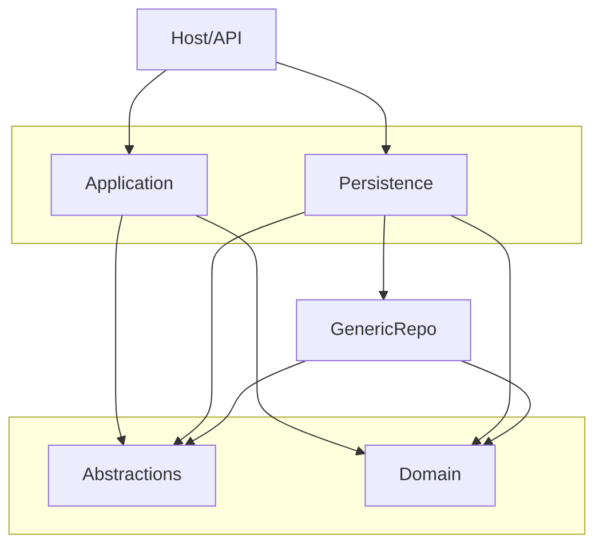
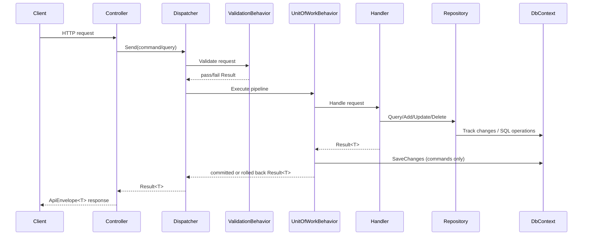

# Backend Foundation Template - Architecture Guide

## 1) Purpose
This template is a Clean Architecture backend foundation designed for reuse across projects.

Main goals:
- strict layer boundaries
- reusable repository/unit-of-work contracts
- provider-agnostic application logic
- consistent API envelope and error handling

The template is intentionally minimal and does not include business-specific sample modules.

## 2) Solution Structure

```text
Backend.Foundation.Template.sln
|- Backend.Foundation.Template                 (Host/API)
|- Backend.Foundation.Template.Application     (Use-cases, handlers, behaviors)
|- Backend.Foundation.Template.Domain          (Entities, value objects, domain base types)
|- Backend.Foundation.Template.Abstractions    (Contracts: repository, UoW, results, paging)
|- Backend.Foundation.Template.GenericRepo     (EF + Mongo generic repository implementations)
|- Backend.Foundation.Template.Persistence     (DbContext, provider wiring, EF configs/migrations)
|- docs/ARCHITECTURE_GUIDE.md
```

## 3) Dependency Direction (Clean Architecture)



Rules:
- `Domain` never depends on infrastructure.
- `Application` depends on `Domain` + `Abstractions` only.
- `Persistence` and `GenericRepo` provide concrete infrastructure.
- `Host` composes all dependencies.

## 4) Layer Responsibilities

### Domain
Contains:
- base entity hierarchy (`Entity`, `AuditableEntity`, `SoftDeletableEntity`, `AggregateRoot`)
- domain entities/value objects/events
- invariants and domain behavior

Must not contain:
- EF/Mongo infrastructure code
- HTTP/DTO/controller code

### Abstractions
Contains:
- `IRepository<,>`, `IUnitOfWork`
- result model (`Result`, `Error`)
- paging contracts
- clock abstraction

Purpose:
- shared contracts consumed by `Application`

### Application
Contains:
- commands/queries and handlers
- validators
- pipeline behaviors (validation + unit-of-work)
- dispatcher

Purpose:
- orchestrate use-cases with infrastructure-agnostic logic

### GenericRepo
Contains:
- `EfRepository<TEntity, TKey>` and `EfUnitOfWork`
- `MongoRepository<TEntity, TKey>` and `MongoUnitOfWork`
- shared helpers (ordering, cursor, metadata, audit stamping)

Purpose:
- reusable generic data-access engine

### Persistence
Contains:
- `AppDbContext`
- EF configurations
- EF migrations
- provider registration for SQL Server/Postgres/Mongo

Purpose:
- infrastructure composition and model mapping

### Host/API
Contains:
- controllers
- API envelope mapping
- global exception middleware
- app startup/DI registration

Purpose:
- HTTP transport and runtime hosting

## 5) Request Processing Workflow



## 6) Transactions and Rollback

For commands:
- `UnitOfWorkBehavior` executes inside `IUnitOfWork.ExecuteInTransactionAsync`.
- Success result => `SaveChangesAsync` + commit.
- Failure result => rollback.
- Exception => rollback/no commit.

For queries:
- no save/no transaction commit path.

## 7) Audit and Soft Delete

`AppDbContext` applies conventions:
- Added => sets `CreatedAtUtc`.
- Modified => sets `UpdatedAtUtc`.
- Deleted soft-deletable => converts to update:
  - `IsDeleted = true`
  - `DeletedAtUtc = utcNow`
  - `UpdatedAtUtc = utcNow`

Timezone note:
- PostgreSQL `timestamp with time zone` stores an instant.
- DB tools may display values in session/local timezone.

## 8) Generic Repository Capabilities

Read/query:
- `Query(...)`
- `GetByIdAsync(...)`
- `GetManyByIdsAsync(...)`
- `FirstOrDefaultAsync(...)`
- `ListAsync(...)`
- `AnyAsync(...)`
- `CountAsync(...)`
- `LongCountAsync(...)`

Write/update:
- `AddAsync(...)`
- `AddRangeAsync(...)`
- `Update(...)` (tracked-safe)
- `PatchAsync(...)`

Delete:
- `SoftDeleteByIdAsync(...)`
- `SoftDeleteWhereAsync(...)`
- `HardDeleteWhereAsync(...)`

Paging:
- `PaginatedAsync(...)` (offset)
- `CursorPaginatedAsync(...)` (cursor)

Transactions:
- repository-level `ExecuteInTransactionAsync(...)`
- command pipeline transaction via UoW behavior

## 9) API Envelope and Errors

Success/failure responses are wrapped in `ApiEnvelope<T>`:
- `message`
- `dateTimeUtc`
- `data`

Error payload fields:
- `errorCode`
- `statusCode`
- `traceId`
- `detail` (optional)

## 10) Persistence Providers

`appsettings` keys:
- `Persistence:Provider` => `None | SqlServer | Postgres | Mongo`
- `ConnectionStrings`
- `Mongo:Database`

Runtime registration:
- SQL providers => `AppDbContext` + EF generic repo.
- Mongo provider => Mongo generic repo.
- No provider => no-op UoW fallback.

## 11) Current API Surface

System:
- `GET /api/system/time`

Business endpoints should be added as project-specific modules.

## 12) How to Add a New Module

1. Domain
- add entities/value objects
- implement invariants and behavior

2. Application
- add command/query records
- add validators
- add handlers using `IRepository<,>` only

3. Persistence
- add entity configurations
- add `DbSet<>` as needed
- create migration

4. Host
- add controller endpoints
- dispatch via `IRequestDispatcher`
- map results through `ToActionResult(...)`

5. Optional tests
- add unit/integration test projects per project needs

## 13) Useful Commands

Build:
```bash
dotnet build Backend.Foundation.Template.sln -c Release
```

Add migration:
```bash
dotnet ef migrations add <MigrationName> \
  --configuration Release \
  --project Backend.Foundation.Template.Persistence \
  --startup-project Backend.Foundation.Template \
  --context AppDbContext \
  --output-dir Sql/Migrations
```

Apply migration:
```bash
dotnet ef database update \
  --configuration Release \
  --project Backend.Foundation.Template.Persistence \
  --startup-project Backend.Foundation.Template \
  --context AppDbContext
```

## 14) Architecture Guardrails

- Keep transport models in Host, not Domain.
- Keep persistence details in Persistence, not Application.
- Keep business rules in Domain/Application, not Controllers.
- Use abstractions in handlers; avoid direct `DbContext` in Application.
- Keep command side transactional and query side read-only.

---
This file is the single source of truth for architecture and usage in this template.
